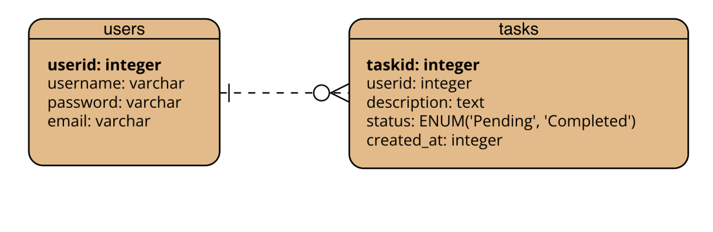

# Team: Sake

## Team Members
- 413855593 (加藤大地)  
- 410855281 (安藤輝翔)  
- 413855171 (李婕亞)  
- 413855114 (耶律楚材)

---

## 1. Demo Scenario Overview

### Demo Features to be Presented
- Users can add a new task with a description.  
- Users can view all current and completed tasks.  
- Users can mark a task as completed.  
- Users can delete a task from the list.

### User Actions to be Shown
1. Navigate to the main task board page.  
2. Fill and submit the **"Add Task"** form.  
3. Click on a **"Complete"** button next to a task.  
4. Click on a **"Delete"** button to remove a task.

### Functional Parts for Demo
- ✅ Task creation (fully implemented)  
- ✅ Task listing (fully implemented, dynamically loads from DB)  
- ✅ Task completion (fully implemented, status updated in DB)  
- ✅ Task deletion (fully implemented)

---

## 2. Planned URL Endpoints

| URL Path             | Method | HTTP Variables     | Session Variables       | DB Operations                        |
|----------------------|--------|--------------------|--------------------------|--------------------------------------|
| `/index.php`         | GET    | —                  | `$_SESSION['user_id']`   | SELECT tasks for current user       |
| `/add_task.php`      | POST   | `task_description` | `$_SESSION['user_id']`   | INSERT new task                     |
| `/complete_task.php` | POST   | `task_id`          | `$_SESSION['user_id']`   | UPDATE task status to `'completed'` |
| `/delete_task.php`   | POST   | `task_id`          | `$_SESSION['user_id']`   | DELETE task                         |
| `/login.php`         | POST   | `username`, `password` | —                    | SELECT user, start session          |
| `/logout.php`        | GET    | —                  | —                        | Destroy session                     |

---

## 3. Database Design

### a. Entity-Relationship Diagram (ERD)

### b. Relational Model

#### `users` Table
- `user_id` INT AUTO_INCREMENT PRIMARY KEY  
- `username` VARCHAR(50) NOT NULL  
- `password` VARCHAR(255) NOT NULL  
- `email` VARCHAR(100) UNIQUE  

#### `tasks` Table
- `task_id` INT AUTO_INCREMENT PRIMARY KEY  
- `user_id` INT NOT NULL  
- `description` TEXT NOT NULL  
- `status` ENUM('pending', 'completed') DEFAULT 'pending'  
- `created_at` DATETIME DEFAULT CURRENT_TIMESTAMP  
- `FOREIGN KEY (user_id)` REFERENCES `users(user_id)` ON DELETE CASCADE  

---

### c. Normalization and 3NF Justification

- **1NF:** All attributes are atomic (e.g., no multi-value fields).  
- **2NF:** All non-key attributes are fully functionally dependent on the whole primary key.  
- **3NF:** No transitive dependencies exist; all fields depend only on the primary key.

### Design Decisions
- Used foreign keys (`user_id`) to link tasks to users instead of duplicating user information in the `tasks` table.  
- Split user credentials and tasks into separate tables to reduce redundancy and improve maintainability.
